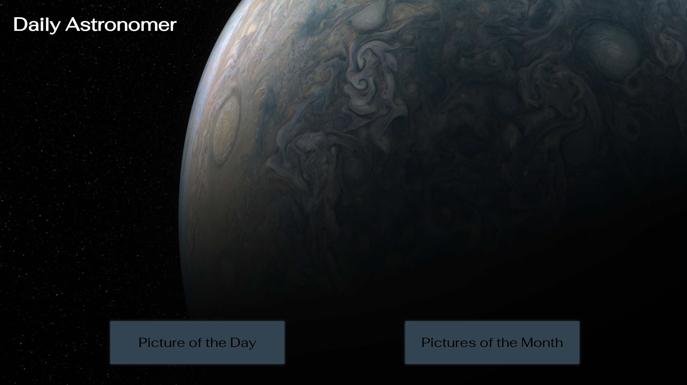
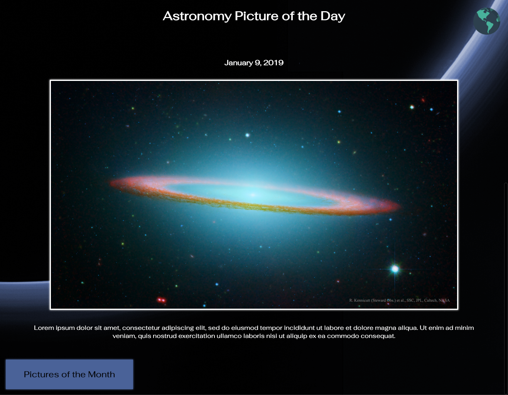
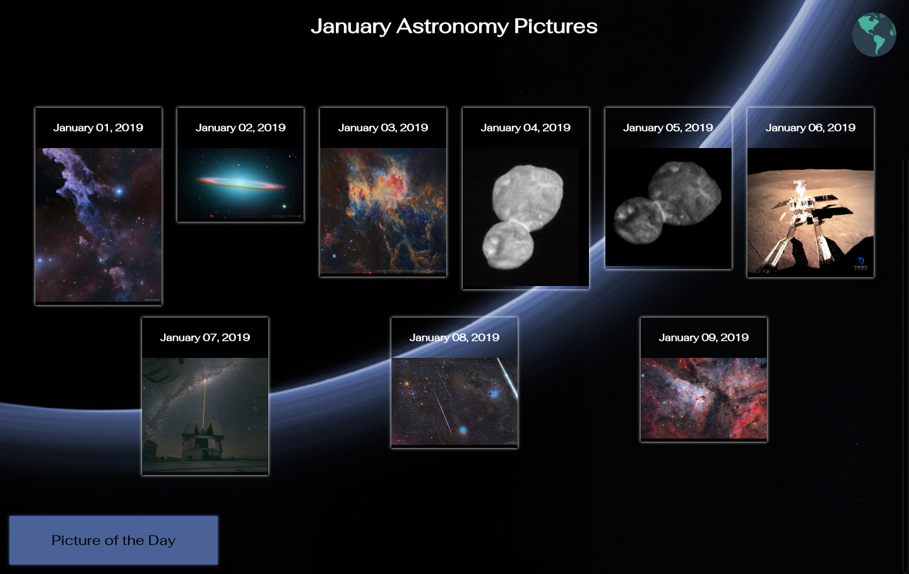
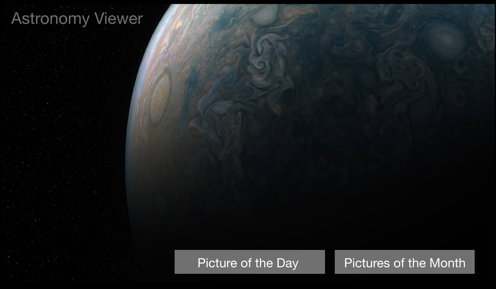
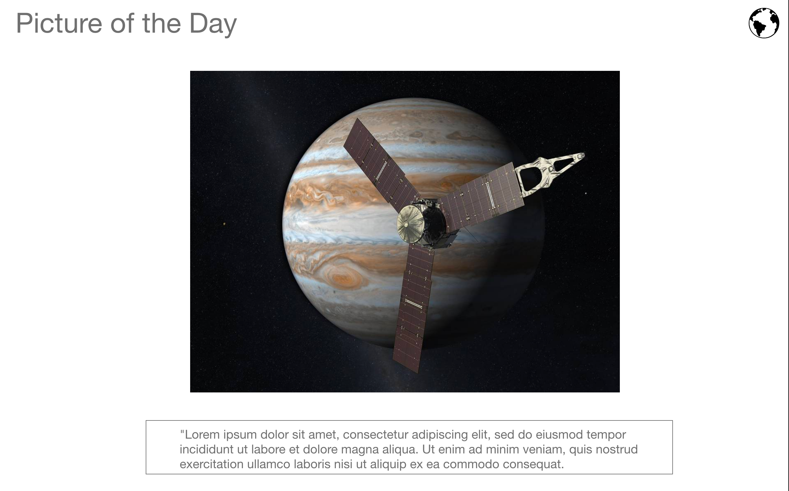
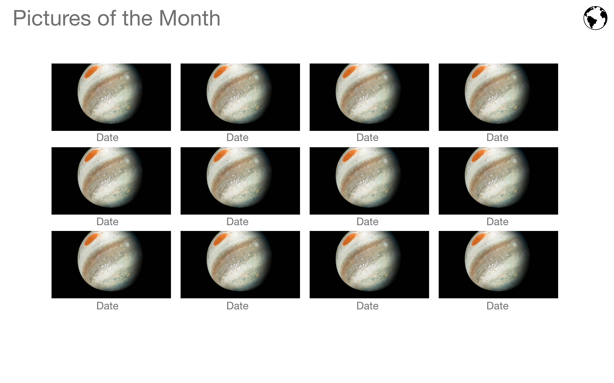

# Daily Astronomer

Daily Astronomer is a Single Page Application build with Vue.js. Users can view the NASA Astronomy Picture of the Day. Users can also view the entire month of images.

### See it Live

[Daily Astronomer](https://nasa-vue-ec464.firebaseapp.com/) on Firebase

### Tech Stack

* Vue.js
* Jest 

### API's used

* NASA APOD

### Screenshots

#### Landing Page:



#### Picture of the Day:



#### Pictures of the Month:



#### Wireframes:




### Setup
#### Frontend

Clone the repo

Run ```npm install``` from the root directory

Run ```npm run serve``` and visit localhost:8080 in your browser


### Test Driven Development

Daily Astronomer uses Jest for frontend testing.

Run tests with ```npm run test:unit``` from the root directory.

### Original Assignment

[Code Challenge](https://gist.github.com/letakeane/28d852307097695c5d50b15857cb28eb) from the [Turing School of Software & Design](https://turing.io/)

### Contributors

* [Tobin Nelson](https://github.com/Tobin-jn)
